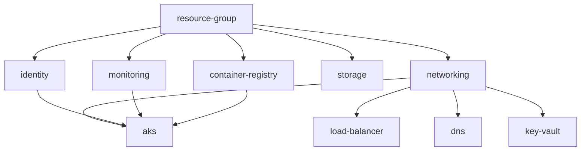

# Terraform AKS Modules

This directory contains modular Terraform configurations organized by Azure resource types. Each module is designed to be reusable, maintainable, and follows Terraform best practices.

## 📁 Module Structure

```
modules/
├── resource-group/        # Azure Resource Group management
├── networking/           # Virtual Network, Subnets, NSG, NAT Gateway
├── identity/             # User Assigned Identities and RBAC
├── aks/                 # AKS Cluster and Node Pools
├── container-registry/   # Azure Container Registry
├── storage/             # Storage Accounts and Containers
├── monitoring/          # Log Analytics and Application Insights
├── key-vault/           # Key Vault and Secrets (placeholder)
├── load-balancer/       # Load Balancer and Rules (placeholder)
└── dns/                 # DNS Zones and Records (placeholder)
```

## 🎯 Design Principles

### **1. Single Responsibility**
Each module manages a specific Azure service or related group of resources:
- **resource-group**: Only manages Azure Resource Groups
- **networking**: Handles all networking components (VNet, Subnets, NSG, etc.)
- **aks**: Manages AKS clusters and node pools
- **storage**: Handles storage accounts and containers

### **2. Reusability**
Modules are designed to be used across different environments:
- Parameterized configurations
- Environment-agnostic resource definitions
- Flexible input variables

### **3. Composability**
Modules can be combined to create complete infrastructure:
- Clear input/output interfaces
- Minimal dependencies between modules
- Well-defined data flow

### **4. Maintainability**
Each module follows consistent patterns:
- Standard file structure (main.tf, variables.tf, outputs.tf)
- Comprehensive documentation
- Clear variable naming conventions

## 🔄 Module Dependencies



## 📋 Module Status

| Module | Status | Description |
|--------|--------|-------------|
| resource-group | ✅ Complete | Azure Resource Group management |
| networking | ✅ Complete | VNet, Subnets, NSG, NAT Gateway |
| identity | ✅ Complete | User Assigned Identities, RBAC |
| aks | ✅ Complete | AKS Cluster, Node Pools |
| container-registry | ✅ Complete | Azure Container Registry |
| storage | ✅ Complete | Storage Accounts, Containers |
| monitoring | ✅ Complete | Log Analytics, App Insights |
| key-vault | 🔄 Placeholder | Key Vault, Secrets, Access Policies |
| load-balancer | 🔄 Placeholder | Load Balancer, Rules, Backend Pools |
| dns | 🔄 Placeholder | DNS Zones, Records, Private DNS |

## 🚀 Usage Examples

### **Individual Module Usage**
```hcl
module "networking" {
  source = "./modules/networking"
  
  environment                   = "dev"
  resource_group_name          = "rg-aks-dev"
  location                     = "East US"
  cluster_name                 = "aks-dev-cluster"
  vnet_address_space           = ["10.1.0.0/16"]
  aks_subnet_address_prefixes  = ["10.1.1.0/24"]
  enable_nat_gateway          = true
  
  tags = {
    Environment = "development"
    Project     = "aks-demo"
  }
}
```

### **Multi-Environment Usage**
```hcl
module "aks" {
  source = "./modules/aks"
  
  for_each = var.environments
  
  environment         = each.key
  resource_group_name = module.resource_group[each.key].name
  location           = module.resource_group[each.key].location
  cluster_name       = each.value.cluster_name
  # ... other configuration
}
```

## 🔧 Module Standards

### **File Structure**
Each module follows this standard structure:
```
module-name/
├── main.tf          # Resource definitions
├── variables.tf     # Input variables
├── outputs.tf       # Output values
└── README.md        # Module documentation
```

### **Variable Naming**
- Use descriptive names: `cluster_name` instead of `name`
- Use snake_case: `resource_group_name`
- Group related variables: `networking = { ... }`
- Provide defaults where appropriate

### **Output Naming**
- Include resource type: `aks_cluster_id`
- Use consistent patterns: `{resource}_{attribute}`
- Mark sensitive outputs: `sensitive = true`

### **Tagging Strategy**
- Accept tags as input variable
- Merge with module-specific tags
- Apply consistently across all resources

## 🔍 Module Testing

### **Validation**
```bash
# Validate individual module
cd modules/networking
terraform init
terraform validate

# Format check
terraform fmt -check
```

### **Integration Testing**
```bash
# Test with root module
terraform plan -var-file="environments/dev/terraform.tfvars"
```

## 📚 Module Documentation

Each module contains detailed documentation including:
- **Purpose**: What the module does
- **Resources**: Azure resources created
- **Variables**: Input parameters and their descriptions
- **Outputs**: Available output values
- **Examples**: Usage examples
- **Dependencies**: Required inputs from other modules

## 🔄 Future Enhancements

### **Planned Modules**
1. **key-vault**: Complete Key Vault implementation
2. **load-balancer**: Azure Load Balancer with health probes
3. **dns**: Public and Private DNS zones
4. **security**: Security Center, Policy assignments
5. **backup**: Backup vaults and policies

### **Module Improvements**
- Add validation rules for input variables
- Implement module versioning
- Add automated testing
- Create module registry

## 🤝 Contributing

When adding new modules:
1. Follow the standard file structure
2. Include comprehensive documentation
3. Add validation for input variables
4. Provide usage examples
5. Update this README with module status

## 📖 Additional Resources

- [Terraform Module Best Practices](https://www.terraform.io/docs/modules/index.html)
- [Azure Provider Documentation](https://registry.terraform.io/providers/hashicorp/azurerm/latest/docs)
- [AKS Documentation](https://docs.microsoft.com/en-us/azure/aks/)
