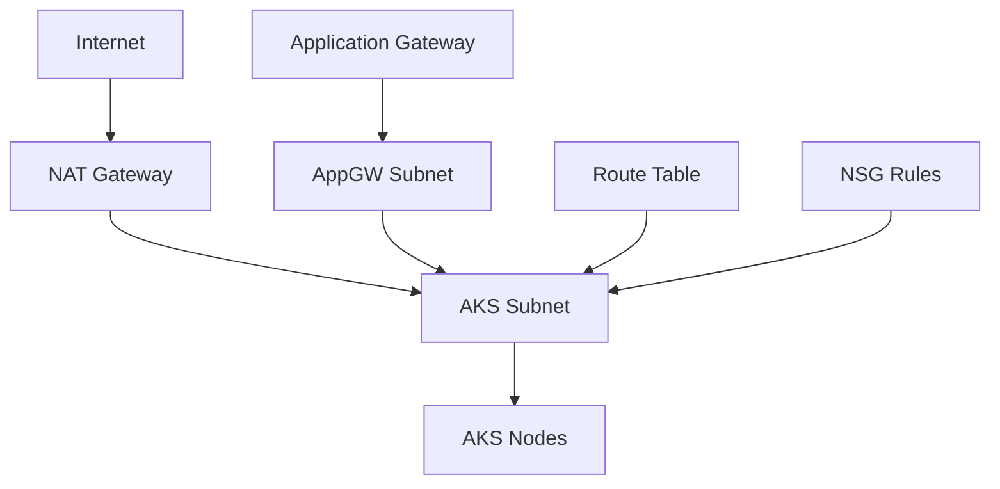

# Networking Module

This module creates and manages all networking components required for AKS deployment including Virtual Networks, Subnets, Network Security Groups, and NAT Gateway.

## 📋 Purpose

The Networking module provides a comprehensive networking foundation for AKS clusters with:
- Isolated virtual networks per environment
- Dedicated subnets for AKS and Application Gateway
- Network security through NSG rules
- Outbound internet connectivity via NAT Gateway
- Custom routing configurations

## 🏗️ Resources Created

- **azurerm_virtual_network**: Virtual network with customizable address space
- **azurerm_subnet**: AKS subnet for cluster nodes
- **azurerm_subnet**: Application Gateway subnet (conditional)
- **azurerm_public_ip**: Public IP for NAT Gateway
- **azurerm_nat_gateway**: NAT Gateway for outbound connectivity
- **azurerm_nat_gateway_public_ip_association**: Associates NAT Gateway with Public IP
- **azurerm_subnet_nat_gateway_association**: Associates NAT Gateway with AKS subnet
- **azurerm_route_table**: Custom route table for traffic control
- **azurerm_route**: Internet route configuration
- **azurerm_subnet_route_table_association**: Associates route table with AKS subnet
- **azurerm_network_security_group**: Network security group with custom rules
- **azurerm_subnet_network_security_group_association**: Associates NSG with AKS subnet

## 📥 Input Variables

| Variable | Type | Description | Default | Required |
|----------|------|-------------|---------|----------|
| `environment` | string | Environment name | - | ✅ |
| `resource_group_name` | string | Name of the resource group | - | ✅ |
| `location` | string | Azure region | - | ✅ |
| `cluster_name` | string | Name of the AKS cluster | - | ✅ |
| `vnet_address_space` | list(string) | Address space for the virtual network | - | ✅ |
| `aks_subnet_address_prefixes` | list(string) | Address prefixes for the AKS subnet | - | ✅ |
| `appgw_subnet_address_prefixes` | list(string) | Address prefixes for the Application Gateway subnet | `[]` | ❌ |
| `enable_application_gateway` | bool | Enable Application Gateway subnet | `false` | ❌ |
| `enable_nat_gateway` | bool | Enable NAT Gateway | `true` | ❌ |
| `network_security_rules` | list(object) | List of network security rules | Default HTTP/HTTPS rules | ❌ |
| `tags` | map(string) | A map of tags to assign to the resources | `{}` | ❌ |

### Network Security Rules Object Structure
```hcl
network_security_rules = [
  {
    name                       = "AllowHTTPS"
    priority                   = 1001
    direction                  = "Inbound"
    access                     = "Allow"
    protocol                   = "Tcp"
    source_port_range          = "*"
    destination_port_range     = "443"
    source_address_prefix      = "*"
    destination_address_prefix = "*"
  }
]
```

## 📤 Outputs

| Output | Type | Description |
|--------|------|-------------|
| `vnet_id` | string | ID of the virtual network |
| `vnet_name` | string | Name of the virtual network |
| `aks_subnet_id` | string | ID of the AKS subnet |
| `aks_subnet_name` | string | Name of the AKS subnet |
| `appgw_subnet_id` | string | ID of the Application Gateway subnet (if enabled) |
| `nat_gateway_id` | string | ID of the NAT Gateway (if enabled) |
| `nat_gateway_public_ip` | string | Public IP address of the NAT Gateway (if enabled) |
| `route_table_id` | string | ID of the route table |
| `network_security_group_id` | string | ID of the network security group |

## 🚀 Usage Examples

### Basic Usage
```hcl
module "networking" {
  source = "./modules/networking"
  
  environment                   = "dev"
  resource_group_name          = "rg-aks-dev"
  location                     = "East US"
  cluster_name                 = "aks-dev-cluster"
  vnet_address_space           = ["10.1.0.0/16"]
  aks_subnet_address_prefixes  = ["10.1.1.0/24"]
  enable_nat_gateway          = true
  
  tags = {
    Environment = "development"
    Project     = "aks-demo"
  }
}
```

### With Application Gateway
```hcl
module "networking" {
  source = "./modules/networking"
  
  environment                   = "staging"
  resource_group_name          = "rg-aks-staging"
  location                     = "East US"
  cluster_name                 = "aks-staging-cluster"
  vnet_address_space           = ["10.2.0.0/16"]
  aks_subnet_address_prefixes  = ["10.2.1.0/24"]
  appgw_subnet_address_prefixes = ["10.2.2.0/24"]
  enable_application_gateway   = true
  enable_nat_gateway          = true
  
  tags = {
    Environment = "staging"
    Project     = "aks-demo"
  }
}
```

### Custom Security Rules
```hcl
module "networking" {
  source = "./modules/networking"
  
  environment                   = "prod"
  resource_group_name          = "rg-aks-prod"
  location                     = "East US"
  cluster_name                 = "aks-prod-cluster"
  vnet_address_space           = ["10.0.0.0/16"]
  aks_subnet_address_prefixes  = ["10.0.1.0/24"]
  
  network_security_rules = [
    {
      name                       = "AllowHTTPS"
      priority                   = 1001
      direction                  = "Inbound"
      access                     = "Allow"
      protocol                   = "Tcp"
      source_port_range          = "*"
      destination_port_range     = "443"
      source_address_prefix      = "*"
      destination_address_prefix = "*"
    },
    {
      name                       = "AllowSSH"
      priority                   = 1002
      direction                  = "Inbound"
      access                     = "Allow"
      protocol                   = "Tcp"
      source_port_range          = "*"
      destination_port_range     = "22"
      source_address_prefix      = "10.0.0.0/8"
      destination_address_prefix = "*"
    },
    {
      name                       = "DenyAll"
      priority                   = 4096
      direction                  = "Inbound"
      access                     = "Deny"
      protocol                   = "*"
      source_port_range          = "*"
      destination_port_range     = "*"
      source_address_prefix      = "*"
      destination_address_prefix = "*"
    }
  ]
  
  tags = {
    Environment = "production"
    Project     = "aks-demo"
  }
}
```

## 🔧 Network Architecture

### Address Space Planning
```
Environment: Development
├── VNet: 10.1.0.0/16 (65,536 IPs)
│   ├── AKS Subnet: 10.1.1.0/24 (256 IPs)
│   └── AppGW Subnet: 10.1.2.0/24 (256 IPs)

Environment: Staging  
├── VNet: 10.2.0.0/16 (65,536 IPs)
│   ├── AKS Subnet: 10.2.1.0/24 (256 IPs)
│   └── AppGW Subnet: 10.2.2.0/24 (256 IPs)

Environment: Production
├── VNet: 10.0.0.0/16 (65,536 IPs)
│   ├── AKS Subnet: 10.0.1.0/24 (256 IPs)
│   └── AppGW Subnet: 10.0.2.0/24 (256 IPs)
```

### Traffic Flow


## 🔒 Security Features

### Network Security Groups
Default security rules include:
- **AllowHTTPS**: Inbound HTTPS traffic (port 443)
- **AllowHTTP**: Inbound HTTP traffic (port 80)
- **Custom Rules**: Additional rules as specified

### NAT Gateway Benefits
- **Outbound Connectivity**: Secure outbound internet access
- **Static IP**: Consistent outbound IP address
- **High Availability**: Built-in redundancy
- **Scalability**: Automatic scaling for outbound connections

### Route Table Configuration
- **Internet Route**: 0.0.0.0/0 → Internet
- **Custom Routes**: Additional routes as needed
- **BGP Propagation**: Disabled by default for security

## 🔗 Dependencies

### Upstream Dependencies
- **resource-group** module: Provides resource group name and location

### Downstream Dependencies
This module's outputs are used by:
- **aks** module: Requires AKS subnet ID
- **identity** module: Requires VNet ID for RBAC assignments
- **load-balancer** module: May require subnet IDs
- **dns** module: Requires VNet ID for private DNS zones

## 🔍 Validation and Testing

### Network Validation
```bash
# Test connectivity
az network vnet show --resource-group rg-aks-dev --name aks-dev-cluster-dev-vnet

# Check subnet configuration
az network vnet subnet show --resource-group rg-aks-dev --vnet-name aks-dev-cluster-dev-vnet --name aks-dev-cluster-dev-aks-subnet

# Verify NAT Gateway
az network nat gateway show --resource-group rg-aks-dev --name aks-dev-cluster-dev-nat-gateway
```

### Security Testing
```bash
# Check NSG rules
az network nsg show --resource-group rg-aks-dev --name aks-dev-cluster-dev-nsg

# Test route table
az network route-table show --resource-group rg-aks-dev --name aks-dev-cluster-dev-rt
```

## 🚨 Important Considerations

### Address Space Planning
- **Non-Overlapping**: Ensure VNet address spaces don't overlap between environments
- **Future Growth**: Plan for subnet expansion
- **Service Integration**: Reserve space for additional services
- **Peering**: Consider address spaces for VNet peering

### Subnet Sizing
- **AKS Subnet**: Plan for maximum node count + pods per node
- **Application Gateway**: Minimum /24 subnet recommended
- **Future Services**: Reserve subnets for additional services

### Security Best Practices
- **Least Privilege**: Only allow necessary traffic
- **Segmentation**: Use subnets to segment different tiers
- **Monitoring**: Enable NSG flow logs for security monitoring
- **Regular Review**: Periodically review and update security rules

## 📊 Cost Optimization

### NAT Gateway Costs
- **Hourly Charge**: Per NAT Gateway instance
- **Data Processing**: Per GB processed
- **Optimization**: Share NAT Gateway across subnets when possible

### Public IP Costs
- **Static IP**: Hourly charge for reserved public IPs
- **Data Transfer**: Outbound data transfer charges

## 🔄 Maintenance

### Regular Tasks
- Review and update NSG rules
- Monitor NAT Gateway usage and costs
- Check for unused public IPs
- Validate route table configurations

### Scaling Considerations
- Plan subnet expansion for growing workloads
- Consider additional NAT Gateways for high-throughput scenarios
- Monitor subnet IP utilization

## 🤝 Contributing

When modifying this module:
1. Validate network configurations don't conflict
2. Test with different environment configurations
3. Update documentation for new features
4. Consider backward compatibility
5. Test security rule changes carefully

## 📚 References

- [Azure Virtual Network Documentation](https://docs.microsoft.com/en-us/azure/virtual-network/)
- [Azure NAT Gateway Documentation](https://docs.microsoft.com/en-us/azure/virtual-network/nat-gateway/)
- [Network Security Groups](https://docs.microsoft.com/en-us/azure/virtual-network/network-security-groups-overview)
- [AKS Networking Concepts](https://docs.microsoft.com/en-us/azure/aks/concepts-network)
